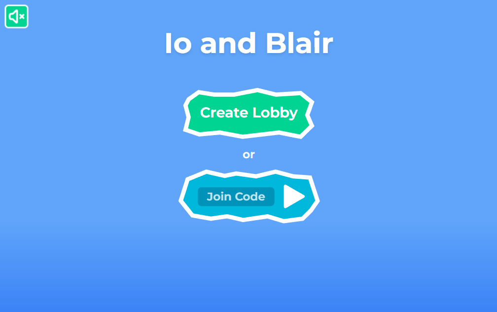
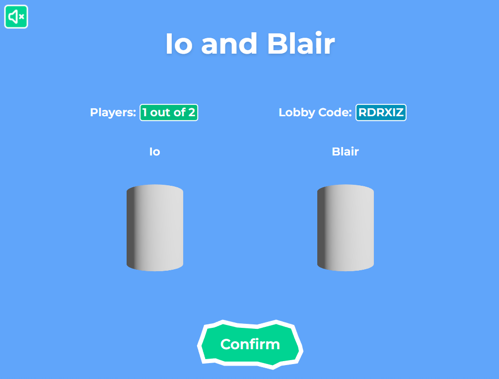
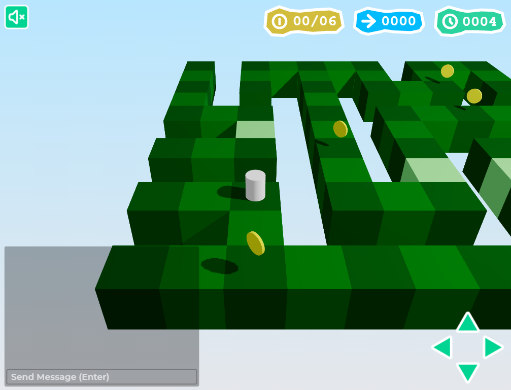

<h1 align="center">Io and Blair</h1>

<h4 align="center">A co-op WebSocket game in the browser. (MODELS PENDING) Play it <a href="https://ioblair.jsonis.me/">here</a>!</h4>

Navigate randomly generated, perilous islands in the sky to collect all the coins. Work together with a partner to uncover hidden paths.

<h4 align="center">
    <a href="#preview"><b>Preview</b></a> •
    <a href="#contrib"><b>Contributors</b></a> •
    <a href="#attrib"><b>Attributions</b></a>
</h4>

<h2 id="preview">🎴 Preview</h2>

<!-- 
https://github.com/user-attachments/assets/f5684601-ac28-4ae9-94a9-486a3d642342 -->

<h2 id="contrib">👥 Contributors</h2>

- [Jason Ly](https://github.com/jasonly027)

<h2 id="attrib">📑 Attributions</h2>

- Background Music - Parade by [フリ](https://dova-s.jp/EN/_contents/author/profile106.html)
